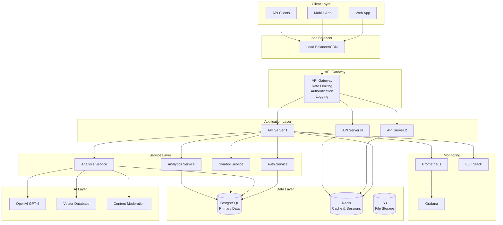
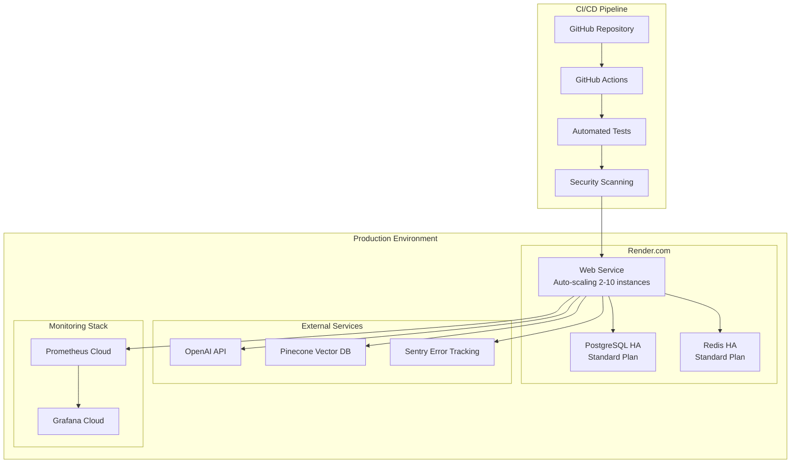

# Architecture Overview

This document provides a comprehensive overview of the Deeper Bible Backend system architecture, including design decisions, patterns, and technical implementation details.

## 📋 Table of Contents

- [System Architecture](#system-architecture)
- [Design Principles](#design-principles)
- [Architecture Patterns](#architecture-patterns)
- [Component Design](#component-design)
- [Data Architecture](#data-architecture)
- [Security Architecture](#security-architecture)
- [Scalability & Performance](#scalability--performance)
- [Architecture Decision Records](#architecture-decision-records)

## System Architecture

### High-Level Architecture



### Deployment Architecture



## Design Principles

### 1. **Separation of Concerns**
- Clear separation between API, business logic, and data layers
- Each service has a single responsibility
- Modular architecture for maintainability

### 2. **Fail-Safe Design**
- Graceful degradation when external services are unavailable
- Circuit breaker patterns for AI services
- Comprehensive error handling and logging

### 3. **Performance First**
- Multi-level caching strategy (Redis + in-memory)
- Database query optimization with indexes
- Async processing for heavy AI operations

### 4. **Security by Design**
- Authentication and authorization at every layer
- Input validation and sanitization
- Rate limiting and abuse prevention

### 5. **Observability**
- Comprehensive logging and metrics
- Distributed tracing for complex operations
- Real-time monitoring and alerting

## Architecture Patterns

### 1. **Layered Architecture**

```typescript
// Clean architecture layers
interface LayeredArchitecture {
  presentation: {
    controllers: ControllerLayer;
    middleware: MiddlewareLayer;
    routes: RouteLayer;
  };
  
  business: {
    services: BusinessLogicLayer;
    validators: ValidationLayer;
    transformers: DataTransformationLayer;
  };
  
  data: {
    repositories: DataAccessLayer;
    models: DataModelLayer;
    migrations: SchemaManagementLayer;
  };
  
  external: {
    aiServices: ExternalAILayer;
    monitoring: ObservabilityLayer;
    notifications: NotificationLayer;
  };
}
```

### 2. **Service-Oriented Architecture**

```typescript
// Service isolation and communication
interface ServiceArchitecture {
  authService: {
    responsibilities: ['user-auth', 'token-management', 'permissions'];
    dependencies: ['database', 'redis'];
    interfaces: ['REST API', 'internal-calls'];
  };
  
  analysisService: {
    responsibilities: ['verse-analysis', 'ai-integration', 'result-caching'];
    dependencies: ['openai', 'pinecone', 'database', 'redis'];
    interfaces: ['REST API', 'async-queue'];
  };
  
  symbolService: {
    responsibilities: ['symbol-detection', 'relationship-mapping'];
    dependencies: ['analysis-service', 'database'];
    interfaces: ['REST API', 'internal-calls'];
  };
}
```

### 3. **Repository Pattern**

```typescript
// Data access abstraction
abstract class Repository<T> {
  abstract create(entity: Partial<T>): Promise<T>;
  abstract findById(id: string): Promise<T | null>;
  abstract findMany(criteria: QueryCriteria<T>): Promise<T[]>;
  abstract update(id: string, updates: Partial<T>): Promise<T>;
  abstract delete(id: string): Promise<boolean>;
}

class AnalysisRepository extends Repository<Analysis> {
  constructor(private db: DatabaseService) {
    super();
  }
  
  async create(analysis: Partial<Analysis>): Promise<Analysis> {
    return this.db.analysis.create(analysis);
  }
  
  async findByUserIdAndVerse(userId: string, verse: string): Promise<Analysis | null> {
    return this.db.analysis.findFirst({
      where: { userId, verseRange: verse }
    });
  }
}
```

### 4. **Factory Pattern**

```typescript
// Service creation and dependency injection
class ServiceFactory {
  private static instances = new Map<string, any>();
  
  static createAnalysisService(): AnalysisService {
    if (!this.instances.has('analysis')) {
      const openaiClient = this.createOpenAIClient();
      const pineconeService = this.createPineconeService();
      const cacheService = this.createCacheService();
      const repository = this.createAnalysisRepository();
      
      this.instances.set('analysis', new AnalysisService(
        openaiClient,
        pineconeService,
        cacheService,
        repository
      ));
    }
    
    return this.instances.get('analysis');
  }
}
```

## Component Design

### 1. **API Controller Pattern**

```typescript
// Standardized controller structure
abstract class BaseController {
  protected handleRequest = (
    handler: (req: Request, res: Response) => Promise<any>
  ) => {
    return async (req: Request, res: Response, next: NextFunction) => {
      try {
        const result = await handler(req, res);
        if (result) {
          res.json(result);
        }
      } catch (error) {
        next(error);
      }
    };
  };
}

class AnalysisController extends BaseController {
  constructor(private analysisService: AnalysisService) {
    super();
  }
  
  analyzeVerse = this.handleRequest(async (req: Request) => {
    const request = AnalysisRequestSchema.parse(req.body);
    return await this.analysisService.analyzeVerse(request);
  });
  
  getHistory = this.handleRequest(async (req: Request) => {
    const { page = 1, limit = 20 } = req.query;
    const userId = req.user.id;
    return await this.analysisService.getHistory(userId, Number(page), Number(limit));
  });
}
```

### 2. **Middleware Chain Pattern**

```typescript
// Composable middleware pipeline
const createMiddlewarePipeline = (...middlewares: Middleware[]) => {
  return (req: Request, res: Response, next: NextFunction) => {
    let index = 0;
    
    const dispatch = (i: number) => {
      if (i >= middlewares.length) return next();
      
      const middleware = middlewares[i];
      return middleware(req, res, () => dispatch(i + 1));
    };
    
    return dispatch(0);
  };
};

// Usage
const analysisPipeline = createMiddlewarePipeline(
  authenticationMiddleware,
  rateLimitMiddleware,
  validationMiddleware(AnalysisRequestSchema),
  loggingMiddleware
);

router.post('/analysis', analysisPipeline, analysisController.analyzeVerse);
```

### 3. **Service Layer Pattern**

```typescript
// Business logic encapsulation
class AnalysisService {
  constructor(
    private openaiClient: OpenAIClient,
    private vectorStore: PineconeService,
    private cacheService: CacheService,
    private repository: AnalysisRepository,
    private monitoringService: MonitoringService
  ) {}
  
  async analyzeVerse(request: AnalysisRequest): Promise<AnalysisResult> {
    const startTime = Date.now();
    
    try {
      // Check cache first
      const cacheKey = this.generateCacheKey(request);
      const cached = await this.cacheService.get(cacheKey);
      if (cached) {
        this.monitoringService.recordCacheHit('analysis');
        return cached;
      }
      
      // Perform AI analysis
      const aiResponse = await this.openaiClient.analyze(request);
      
      // Detect symbols if requested
      let symbols = [];
      if (request.includeSymbols) {
        symbols = await this.detectSymbols(aiResponse.text);
      }
      
      // Find cross references
      const crossReferences = await this.findCrossReferences(
        request.verseRange, 
        aiResponse.themes
      );
      
      // Build result
      const result: AnalysisResult = {
        id: generateId(),
        verseRange: request.verseRange,
        translation: request.translation,
        analysis: aiResponse,
        symbols,
        crossReferences,
        confidenceScore: aiResponse.confidence,
        processingTimeMs: Date.now() - startTime,
        createdAt: new Date().toISOString()
      };
      
      // Cache and store
      await Promise.all([
        this.cacheService.set(cacheKey, result, 3600),
        this.repository.create(result)
      ]);
      
      this.monitoringService.recordAnalysisSuccess(result);
      return result;
      
    } catch (error) {
      this.monitoringService.recordAnalysisError(error);
      throw error;
    }
  }
}
```

## Data Architecture

### 1. **Database Schema Design**

```sql
-- Core tables with proper relationships and indexes
CREATE TABLE users (
    id UUID PRIMARY KEY DEFAULT gen_random_uuid(),
    email VARCHAR(255) UNIQUE NOT NULL,
    password_hash VARCHAR(255) NOT NULL,
    name VARCHAR(255),
    preferences JSONB DEFAULT '{}',
    created_at TIMESTAMP WITH TIME ZONE DEFAULT NOW(),
    updated_at TIMESTAMP WITH TIME ZONE DEFAULT NOW()
);

CREATE TABLE analysis_results (
    id UUID PRIMARY KEY DEFAULT gen_random_uuid(),
    user_id UUID REFERENCES users(id) ON DELETE CASCADE,
    verse_range VARCHAR(100) NOT NULL,
    translation VARCHAR(10) DEFAULT 'ESV',
    text TEXT NOT NULL,
    analysis JSONB NOT NULL,
    symbols JSONB DEFAULT '[]',
    cross_references JSONB DEFAULT '[]',
    confidence_score DECIMAL(3,2),
    processing_time_ms INTEGER,
    created_at TIMESTAMP WITH TIME ZONE DEFAULT NOW()
);

-- Optimized indexes
CREATE INDEX idx_analysis_user_created ON analysis_results(user_id, created_at DESC);
CREATE INDEX idx_analysis_verse ON analysis_results USING gin(verse_range gin_trgm_ops);
CREATE INDEX idx_analysis_text_search ON analysis_results USING gin(to_tsvector('english', text));
CREATE INDEX idx_analysis_symbols ON analysis_results USING gin(symbols);

-- Partitioning for large datasets
CREATE TABLE analysis_results_y2024m01 PARTITION OF analysis_results
    FOR VALUES FROM ('2024-01-01') TO ('2024-02-01');
```

### 2. **Caching Strategy**

```typescript
// Multi-level caching architecture
interface CachingStrategy {
  L1_Memory: {
    purpose: 'Hot data, frequently accessed';
    ttl: '5 minutes';
    maxSize: '100MB per instance';
    evictionPolicy: 'LRU';
  };
  
  L2_Redis: {
    purpose: 'Shared cache across instances';
    ttl: '1 hour to 24 hours';
    maxSize: '2GB';
    evictionPolicy: 'allkeys-lru';
  };
  
  L3_Database: {
    purpose: 'Persistent storage with query cache';
    ttl: 'permanent';
    queryCache: 'PostgreSQL buffer pool';
  };
}

class CacheService {
  private memoryCache = new Map<string, CacheEntry>();
  
  async get(key: string): Promise<any> {
    // L1: Memory cache
    const memoryEntry = this.memoryCache.get(key);
    if (memoryEntry && !this.isExpired(memoryEntry)) {
      return memoryEntry.value;
    }
    
    // L2: Redis cache
    const redisValue = await this.redis.get(key);
    if (redisValue) {
      const parsed = JSON.parse(redisValue);
      // Populate L1 cache
      this.memoryCache.set(key, {
        value: parsed,
        expiry: Date.now() + 300000 // 5 minutes
      });
      return parsed;
    }
    
    return null;
  }
}
```

### 3. **Data Migration Strategy**

```typescript
// Version-controlled database migrations
interface Migration {
  version: string;
  up: () => Promise<void>;
  down: () => Promise<void>;
}

class MigrationRunner {
  private migrations: Migration[] = [
    {
      version: '001_initial_schema',
      up: async () => {
        await this.db.schema.createTable('users', table => {
          table.uuid('id').primary().defaultTo(this.db.raw('gen_random_uuid()'));
          table.string('email').unique().notNullable();
          table.timestamp('created_at').defaultTo(this.db.fn.now());
        });
      },
      down: async () => {
        await this.db.schema.dropTable('users');
      }
    }
  ];
  
  async runMigrations(): Promise<void> {
    const appliedMigrations = await this.getAppliedMigrations();
    const pendingMigrations = this.migrations.filter(
      m => !appliedMigrations.includes(m.version)
    );
    
    for (const migration of pendingMigrations) {
      await migration.up();
      await this.recordMigration(migration.version);
    }
  }
}
```

## Security Architecture

### 1. **Authentication & Authorization**

```typescript
// JWT-based authentication with RBAC
interface SecurityArchitecture {
  authentication: {
    method: 'JWT Bearer Token';
    provider: 'Google OAuth 2.0';
    tokenExpiry: '24 hours';
    refreshToken: '7 days';
  };
  
  authorization: {
    model: 'Role-Based Access Control (RBAC)';
    roles: ['user', 'premium', 'admin'];
    permissions: ['analysis:read', 'analysis:create', 'admin:users'];
  };
  
  dataProtection: {
    encryption: 'AES-256 for sensitive data';
    hashing: 'bcrypt for passwords';
    secrets: 'Environment variables + Secrets Manager';
  };
}

class AuthenticationService {
  async authenticateToken(token: string): Promise<User | null> {
    try {
      const payload = jwt.verify(token, process.env.JWT_SECRET!) as JWTPayload;
      const user = await this.userRepository.findById(payload.userId);
      
      if (!user || user.tokenVersion !== payload.tokenVersion) {
        return null;
      }
      
      return user;
    } catch (error) {
      this.logger.warn('Token authentication failed', { error: error.message });
      return null;
    }
  }
  
  async authorize(user: User, permission: string): Promise<boolean> {
    const userRole = await this.getUserRole(user.id);
    const rolePermissions = await this.getRolePermissions(userRole);
    
    return rolePermissions.includes(permission);
  }
}
```

### 2. **Input Validation & Sanitization**

```typescript
// Comprehensive input validation
const AnalysisRequestSchema = z.object({
  verse_range: z.string()
    .min(1, 'Verse range is required')
    .max(100, 'Verse range too long')
    .regex(/^[A-Za-z0-9 :-]+$/, 'Invalid characters in verse range'),
  
  translation: z.enum(['ESV', 'KJV', 'NIV', 'NASB', 'NLT', 'NKJV'])
    .default('ESV'),
  
  analysis_type: z.array(
    z.enum(['theological', 'historical', 'symbolic', 'cross_reference'])
  ).default(['theological']),
  
  denomination: z.enum(['protestant', 'catholic', 'orthodox', 'pentecostal'])
    .optional()
});

// Sanitization middleware
const sanitizationMiddleware = (req: Request, res: Response, next: NextFunction) => {
  // Remove potentially dangerous characters
  const sanitizeString = (str: string): string => {
    return DOMPurify.sanitize(str, { 
      ALLOWED_TAGS: [],
      ALLOWED_ATTR: []
    });
  };
  
  if (req.body) {
    req.body = sanitizeObject(req.body, sanitizeString);
  }
  
  next();
};
```

### 3. **Rate Limiting & Abuse Prevention**

```typescript
// Multi-tier rate limiting
interface RateLimitConfig {
  free: {
    requests: 100;
    window: '1 hour';
    burst: 10;
  };
  
  premium: {
    requests: 1000;
    window: '1 hour';
    burst: 50;
  };
  
  enterprise: {
    requests: 'unlimited';
    burst: 100;
  };
}

class RateLimitService {
  async checkRateLimit(userId: string, tier: 'free' | 'premium' | 'enterprise'): Promise<RateLimitResult> {
    const config = this.getRateLimitConfig(tier);
    const key = `ratelimit:${userId}:${Date.now() - (Date.now() % config.windowMs)}`;
    
    const current = await this.redis.incr(key);
    await this.redis.expire(key, config.windowMs / 1000);
    
    const allowed = current <= config.requests;
    const remaining = Math.max(0, config.requests - current);
    const resetTime = Date.now() + config.windowMs;
    
    return {
      allowed,
      remaining,
      resetTime,
      retryAfter: allowed ? null : resetTime - Date.now()
    };
  }
}
```

## Scalability & Performance

### 1. **Horizontal Scaling Strategy**

```typescript
// Auto-scaling configuration
interface ScalingStrategy {
  webServers: {
    min: 2;
    max: 10;
    scaleUpThreshold: 'CPU > 70% for 5 minutes';
    scaleDownThreshold: 'CPU < 30% for 10 minutes';
    scaleUpCooldown: '5 minutes';
    scaleDownCooldown: '10 minutes';
  };
  
  database: {
    readReplicas: 2;
    connectionPooling: {
      min: 2;
      max: 20;
      idleTimeout: '10 seconds';
      acquireTimeout: '60 seconds';
    };
  };
  
  redis: {
    clustering: true;
    shards: 3;
    replication: true;
  };
}
```

### 2. **Performance Optimization**

```typescript
// Performance monitoring and optimization
class PerformanceOptimizer {
  async optimizeQuery(query: string, params: any[]): Promise<QueryResult> {
    const startTime = performance.now();
    
    // Query plan analysis
    const plan = await this.db.raw(`EXPLAIN ANALYZE ${query}`, params);
    
    const result = await this.db.raw(query, params);
    const duration = performance.now() - startTime;
    
    // Log slow queries
    if (duration > 1000) {
      this.logger.warn('Slow query detected', {
        query,
        duration,
        plan: plan.rows
      });
    }
    
    return result;
  }
  
  async optimizeCacheStrategy(key: string, data: any): Promise<void> {
    const size = JSON.stringify(data).length;
    
    // Different TTL based on data size and access patterns
    let ttl = 3600; // 1 hour default
    
    if (size > 100000) { // Large data
      ttl = 7200; // 2 hours
    } else if (await this.isHotData(key)) {
      ttl = 1800; // 30 minutes for frequently accessed
    }
    
    await this.cacheService.set(key, data, ttl);
  }
}
```

## Architecture Decision Records

### ADR-001: Database Choice - PostgreSQL

**Status**: Accepted  
**Date**: 2024-01-15

**Context**: Need a robust database for structured data with JSON support for flexible analysis results.

**Decision**: Use PostgreSQL as the primary database.

**Consequences**:
- ✅ Excellent JSON/JSONB support for analysis data
- ✅ Strong consistency and ACID properties
- ✅ Advanced indexing capabilities (GIN, GIST)
- ✅ Full-text search capabilities
- ❌ Slightly more complex than NoSQL for pure document storage

### ADR-002: Caching Strategy - Redis

**Status**: Accepted  
**Date**: 2024-01-15

**Context**: Need fast caching for AI analysis results and session management.

**Decision**: Use Redis for distributed caching and session storage.

**Consequences**:
- ✅ High performance in-memory operations
- ✅ Rich data structures (strings, hashes, lists, sets)
- ✅ Built-in persistence and replication
- ✅ Excellent for rate limiting and session management
- ❌ Additional infrastructure complexity

### ADR-003: AI Integration - OpenAI GPT-4

**Status**: Accepted  
**Date**: 2024-01-15

**Context**: Need high-quality theological analysis with consistent output format.

**Decision**: Use OpenAI GPT-4 as the primary AI service with structured prompts.

**Consequences**:
- ✅ State-of-the-art language understanding
- ✅ Consistent API and JSON response format
- ✅ Good handling of theological and historical content
- ❌ External dependency and potential cost scaling
- ❌ Rate limiting considerations

### ADR-004: Deployment Platform - Render.com

**Status**: Accepted  
**Date**: 2024-01-15

**Context**: Need reliable, scalable hosting with good DevOps integration.

**Decision**: Use Render.com for application hosting with auto-scaling.

**Consequences**:
- ✅ Simple deployment with Git integration
- ✅ Auto-scaling and zero-downtime deployments
- ✅ Managed PostgreSQL and Redis
- ✅ Good monitoring and logging capabilities
- ❌ Less control than self-managed infrastructure
- ❌ Potential vendor lock-in

---

**Document Maintenance**:
- **Last Updated**: August 2024
- **Next Review**: February 2025
- **Owner**: Development Team
- **Approver**: Technical Lead

For questions about this architecture, contact the development team or create an issue in the repository.